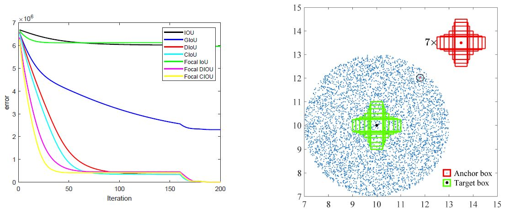

## Abstract

 

Bounding box regression has become a key part of object detection task. However, the traditional regression losses ( $\ell_2$ loss function, Smooth $\ell_1$ loss function, e.t.c) used in the training stage of object detection are not tailored to the IOU (Intersection over Union) based evaluation metric used in the testing stage. Recently, researchers have proposed several IOU-based loss functions in the training stage to narrow the gap between the training loss function and the testing IOU-based metric, but they still suffer from problems such as slow convergence and low accuracy for small object detection. The focal loss, primarily used in the region classification of object detection, is an effective method to address the extreme imbalance of foreground and background classes and achieved great success. In this paper, we propose focal IOU loss for bounding box regression and find that this new loss can not only speed up convergence but also increase the overall accuracy, especially improve the small object detection accuracy. By incorporating this focal IOU loss into representative object detection models or backbones, e.g., SSD and Faster-RCNN, we achieve notable accuracy improvement. We explain the reason of this improvement as a dynamic learning rate adjustment scheme brought by the introduction of focal loss. Our method is orthogonal to IOU based losses and thus can be incorporated into any IOU based losses to improve their performance further.

## Authors

<table style="width:100% bgcolor:#FFFFFF" align="center">
  <tr>
    <th></th>
    <th></th>
  </tr>
  <tr align="center">
    <th>Zihao Xu</th>
    <th>Hongtao Lu</th>
  </tr>
</table>

<!--
## Demo
 A introduction demo can be download from this [link](https://jbox.sjtu.edu.cn/link/view/2f2f1e8ea0f1464fb45b3fe71db68441).
-->

## Code
- [Focal IoU Loss into Faster-RCNN](https://github.com/shsjxzh/Focal-IOU-Detectron)
- [Focal IoU Loss into SSD](https://github.com/shsjxzh/Focal-IOU-SSD)

<!--

We provide source code on , including:

<table>
  <tr>
    <td> 1. Train/Test code.</td>
  </tr>
  <tr>
    <td> 2. Visualization tool for attention mechanism.</td>
  </tr>
</table>

-->

<!--
## Sample Usage

Our model can handle COCO, Flickr8k and Flickr30k dataset. For simplicity, we only present Flickr8k here. 

 1. Create folder ./code/dataset 

 2. Download processed Flickr8k Image Captioning Dataset from [here](https://pan.baidu.com/s/1bpSDwJl) with key: sh4u 

 3. Unzip the downloaded file in ./code/dataset/ 

 4. Download resnet50 model file in ./code/saved_model/ from [here](https://pan.baidu.com/s/1nwYEQAP) with key: h712

 4. Run ./code/main.py with python3 

-->

## Paper

Our paper will be available soon!
<!--
 Our paper is available [here](https://github.com/shsjxzh/Visual-Rhythm-Prediction-with-Feature-Aligning-Network/blob/gh-pages/doc/FAN.pdf)
-->

<!--
## Bibtex
<pre style="font-size: 1.5em;">
@article{Xie2019VisualRhythm,
          title={Visual Rhythm Prediction with Feature Aligning Network},
          author={Xie, Yutong and Wang, haiyang and Hao, Yan and Xu, Zihao},
          year={2019},
          howpublished={\url{https://github.com/shsjxzh/Visual-Rhythm-Prediction-with-Feature-Aligning-Network}}
        }
</pre>
-->
